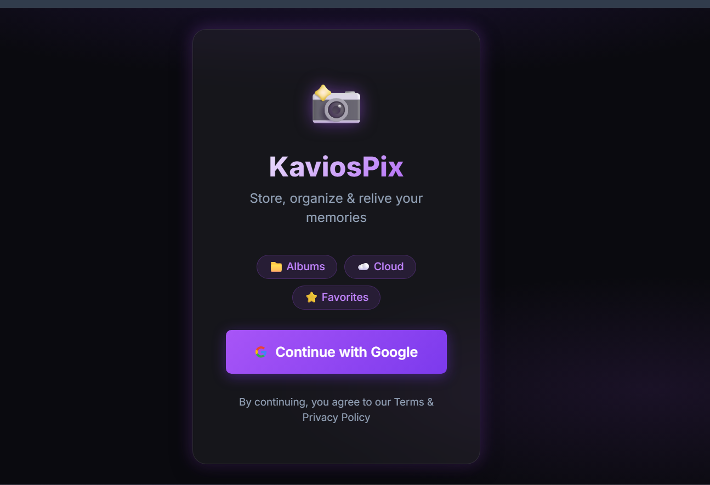

## KavioPix

KaviosPix is a full-stack image management system where users can securely upload, organize, and share images. We implemented Google OAuth for authentication and used JWT for secure API access. Images are stored using Cloudinary, and metadata like tags, favorites, and comments are managed in MongoDB. The system also supports album sharing via email with controlled permissions.

---

## Demo Link

[Live Demo](https://placecode.co/)

---

## Quick Start 

```
git clone https://github.com/Sourabhpande532/Imgixy.git
cd kaviospix
npm install
npm run dev

```

---


## Technology

- React (TypeScript)
- Node Js
- Express JS
- Mongo DB
- Cloudinary (Image Storage)
- Google OAuth 2.0
- JWT Authentication
- RESTful APIs
- Bootstrap (UI)


---

## Demo Video 

Watch a walkthrough (5-7 minutes) of all major features of this age:
[Drive Video Link](https://drive.google.com/file/d/1I6qPh8k2N3v797tYNQmUhBB3up818tEe/view?usp=sharing)

---

## Reference 



---

<video width="520" height="240" controls>
  <source src="./assets/kaviospecs.mov.mp4" type="video/mp4">
</video>

---


## Features 

### Authentication 
- Google OAuth login 
- JWT-based secure access

---
### Albums 
- Create, update, delete albums 
- Share albums via email 
- View owned & shared albums 

---

### Images 

- Upload images (JPG,PNG,GIF, max 5MB)
- Store using Cloudinary
- Add metadata:
  - tags 
  - person name
  - Favorite 
  - comments 

---

### Extras

- Mark images as favorite
- Add & view comments
- Filter by tags / favorites

---

### UI/UX 

- Responsive design
- Bootstrap UI
- Modals for actions
- Toast notifications
- Loaders & empty states

---

## API (Key Endpoints)

**Auth**
- GET /auth/google
- GET /auth/google/callback

---
**Albums**

- POST /albums
- GET /albums
- PUT /albums/:id
- DELETE /albums/:id
- POST /albums/:id/share

---

**Images**
- POST /images/:albumId
- GET /images/:albumId
- PUT /images/:imageId/favorite
- POST /images/:imageId/comment
- DELETE /images/:imageId

---


## Environment Setup

**Backend (.env)**
```
PORT=5001

MONGO_URI=your_mongodb_uri

JWT_SECRET=your_secret_key

GOOGLE_CLIENT_ID=your_google_client_id
GOOGLE_CLIENT_SECRET=your_google_client_secret

CLOUDINARY_NAME=your_cloudinary_name
CLOUDINARY_API_KEY=your_api_key
CLOUDINARY_API_SECRET=your_api_secret

FRONTEND_URL=http://localhost:5173

```

**Frontend(.env)**

```
VITE_API_URL=http://localhost:5001

```

## Contact 

For bugs or feature requests, please reach out to [sourabhpande43@gmail.com](mailto:sourabhpande43@gmail.com)

---